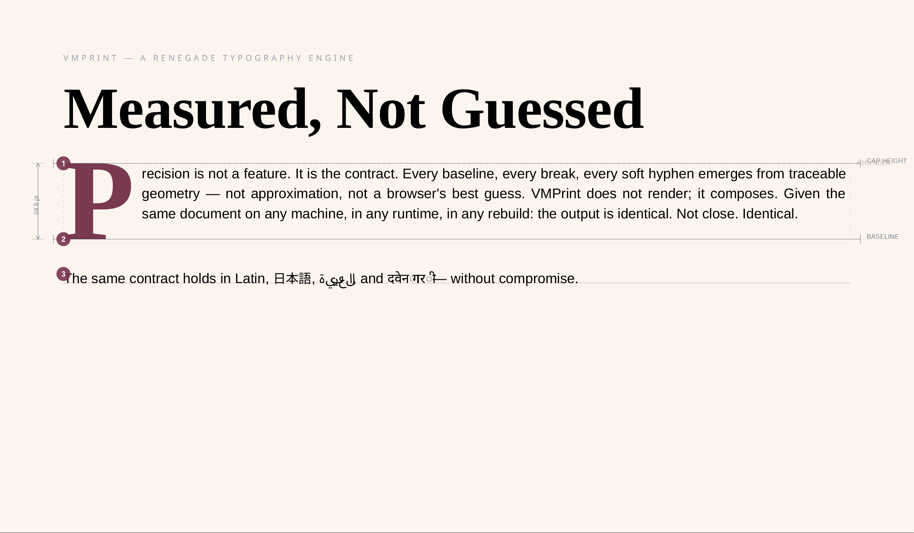
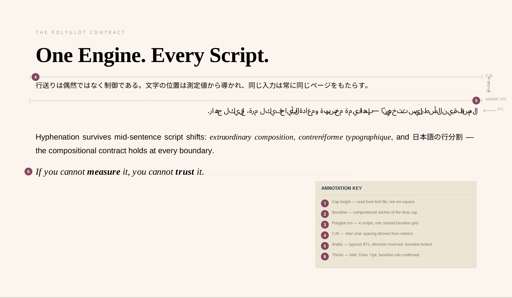
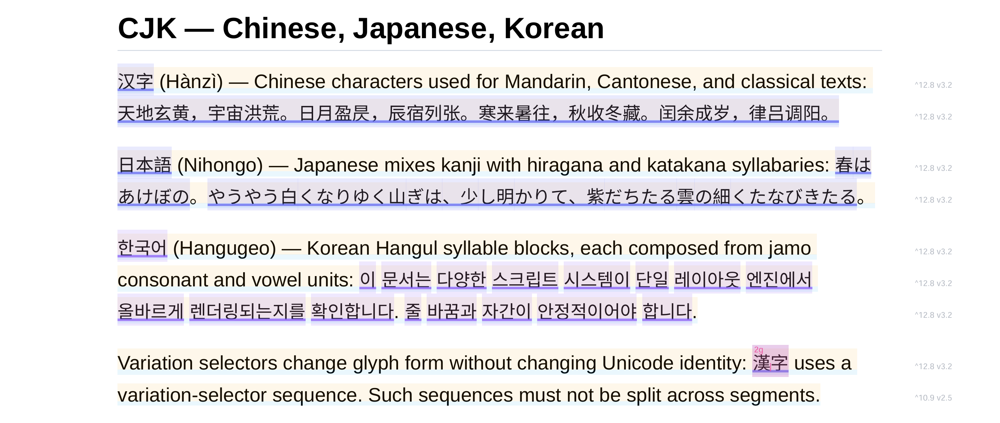
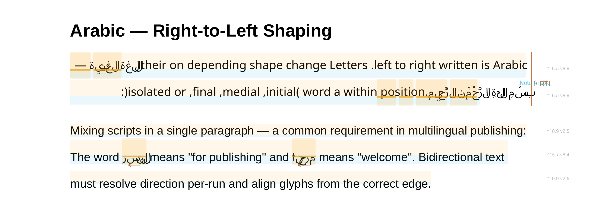
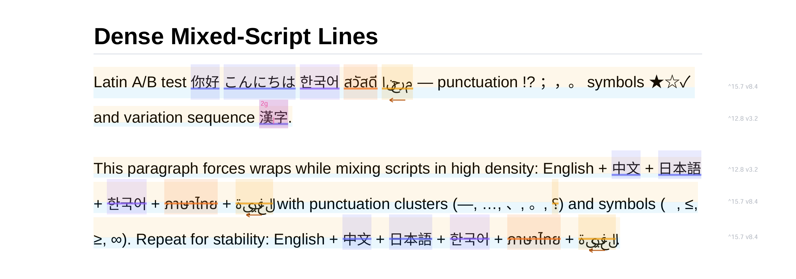

# VMPrint
:: Deterministic typesetting for the programmable web.

## A pure-JS, zero-dependency typesetting engine that yields bit-perfect PDF output across any runtime—from Cloudflare Workers to the browser. Stop using Headless Chrome to print text.

If you generate PDFs with headless browsers or HTML-to-PDF tools, you've accepted a compromise: heavy dependencies, memory leaks, and "approximate" layout that shifts across environments. VMPrint offers a stable, high-performance alternative. It composes documents from a versioned JSON instruction stream and guarantees identical layout given identical input, down to the sub-point position of every glyph.

*Open-source documentation deserves better than the "crude" look of standard Markdown-to-PDF exports. [Read the beautifully typeset PDF version of this README](docs/readme/readme.pdf) — generated from this source file using `draft2final` and the `opensource` flavor (a gift to help the community move past boring documents, and a gentle nod to a director's benevolent insistence on aesthetic standards).*

---




> **Publication-grade layout rendered directly by the VMPrint engine.** The above image -- including all annotations, measurement guides, legends, and script direction markers -- are rendered entirely by VMPrint. The source documents are available in the repository under /docs/readme/.

## Features at a Glance

- Deterministic layout engine with a versioned instruction schema
- Zero browser or Node.js dependencies — runs anywhere
- Multilingual text shaping: Latin, CJK, RTL scripts
- Pluggable font and rendering backends
- Layout output is JSON — snapshot it, diff it, inspect it
- Identical PDF output across machines and runtimes
- 88 KiB core, renders complex documents in milliseconds

---



> **One engine. Every script. Baselines, shaping, and directionality remain stable across mixed-language content.** The above image -- including all annotations, measurement guides, legends, and script direction markers -- are rendered entirely by VMPrint. The source documents are available in the repository under /docs/readme/.


## Background

In the 1980s and 90s, serious software thought seriously about pages. TeX got hyphenation and justification right. Display PostScript gave NeXT workstations a real imaging model — every application had access to typographically precise, device-independent layout at the OS level. Desktop publishing software understood widows, orphans, and the subtle difference between a line break and a paragraph break.

Then the web happened. Mostly great. But somewhere along the way, "generate a PDF" became either "run a headless Chromium instance" or "write your own pagination loop against a low-level drawing API." Neither of these is good. The thinking that went into document composition — the kind that made TeX and PostScript genuinely good — largely disappeared from the toolkit of the working developer.

VMPrint is an attempt to recover some of what was lost.

## The Core Idea

VMPrint works in two stages, and keeping them separate is the whole point.

**Stage 1 — Layout.** You give it a document: structured JSON, or Markdown via `draft2final`. It measures glyphs, wraps lines, handles hyphenation, paginates tables, controls orphans and widows, places floats. It produces a `Page[]` stream — an array of pages, each containing a flat list of absolutely-positioned boxes.

**Stage 2 — Rendering.** A renderer walks those boxes and paints them to a context. Today that context is a PDF. Tomorrow it could be canvas, SVG, or a test spy.

The `Page[]` stream is the thing that makes this different. It's serializable JSON. You can diff it between versions. You can snapshot it for regression tests. You can inspect it to understand why something ended up where it did. Layout bugs become reproducible. This is not how PDF generation usually works.

Layout is based on real font metrics. VMPrint loads actual font files, reads glyph advance widths and kerning data, and measures text the way a typesetting system does — not the way a browser estimates it from computed styles. There is no CSS box model underneath. Same font files, same input, same config: identical output, down to the sub-point position of every glyph.

```ts
const engine = new LayoutEngine(config, runtime);
await engine.waitForFonts();

// pages is a plain Page[] — inspect it, snapshot it, diff it
const pages = engine.paginate(document.elements);

const renderer = new Renderer(config, false, runtime);
await renderer.render(pages, context);
```

## Identical Output, Everywhere

The core engine has no dependency on Node.js, the browser, or any specific JavaScript runtime. It doesn't call `fs`. It doesn't touch the DOM. It doesn't assume `Buffer` exists. Font loading and rendering are injected through well-defined interfaces — the engine itself is pure, environment-agnostic JavaScript.

In practice: run VMPrint in a browser extension, a Cloudflare Worker, a Lambda, and a Node.js server. The layout output is identical. Same page breaks. Same line wraps. Same glyph positions. The rendering context changes; the layout does not.

This is not a promise about "should work in theory." It's an architectural constraint that was enforced from the beginning.

## Why Not Just Use...

**Headless Chrome / Puppeteer**: Works great until it doesn't. Cold starts are slow. Output drifts across browser versions. Edge runtimes typically can't run it at all. You're maintaining a Chromium dependency to produce text in a box — and Chromium is ~170 MB on disk. VMPrint's full dependency tree, including the font engine that makes real glyph measurement possible, is ~2 MiB packed and ~8.7 MiB unpacked.

**PDFKit / pdf-lib / react-pdf**: You're writing pagination. "If this paragraph doesn't fit, cut here, carry the rest to the next page" — by hand, for every element type, including tables that span pages and headings that must stay with what follows them.

**LaTeX**: Genuinely excellent at what it does. Also requires a TeX installation, a 1970s input format, and an afternoon of fighting package conflicts.

VMPrint handles the pagination. You describe your document. It figures out where things break.

## How It Started

> I'm a film director. I hated writing in screenplay software, so I started writing in plain text. Then I wrote a book in Markdown and wanted industry-standard manuscript output — and found no tool I trusted to get there without pain.
>
> Low-level PDF libraries made me implement my own pagination. Headless browser pipelines were heavy and unpredictable. So I took a detour and built a layout engine first.
>
> The manuscript is still waiting. The engine shipped instead.

## Getting Started

Prerequisites: Node.js 18+, pnpm 9+

```bash
git clone https://github.com/cosmiciron/vmprint.git
cd vmprint
pnpm install
```

Render a JSON document to PDF:

```bash
pnpm cli -i packages/engine/tests/fixtures/regression/00-all-capabilities.json -o out.pdf
```

Markdown to PDF (screenplay format):

```bash
pnpm d2f build packages/draft2final/tests/fixtures/screenplay-sample.md -o screenplay.pdf --format screenplay
```

## Full API Example

```ts
import fs from 'fs';
import { LayoutEngine, Renderer, toLayoutConfig, createEngineRuntime } from '@vmprint/engine';
import { PdfContext } from '@vmprint/context-pdf';
import { LocalFontManager } from '@vmprint/local-fonts';

const runtime = createEngineRuntime({ fontManager: new LocalFontManager() });
const config = toLayoutConfig(documentInput);
const engine = new LayoutEngine(config, runtime);

await engine.waitForFonts();
const pages = engine.paginate(documentInput.elements);

const output = fs.createWriteStream('output.pdf');
const context = new PdfContext(output, {
  size: [612, 792],
  margins: { top: 0, right: 0, bottom: 0, left: 0 },
  autoFirstPage: false,
  bufferPages: false
});

const renderer = new Renderer(config, false, runtime);
await renderer.render(pages, context);
```

## What It Can Do

**Pagination**
- `keepWithNext`, `pageBreakBefore`, orphan and widow controls
- Tables that span pages: `colspan`, `rowspan`, row splitting, repeated header rows
- Drop caps
- Story zones with float-aware text wrapping
- Inline images and rich objects on text baselines
- Continuation markers when content splits across pages

**Typography and Multilingual**

Most libraries treat international text as an optional concern — get ASCII layout working first, bolt on Unicode support later. VMPrint's text pipeline was built correctly from the start, because the alternative produces subtly wrong output for most of the world's writing systems.

- Text segmentation uses `Intl.Segmenter` for grapheme-accurate line breaking. A grapheme cluster spanning multiple Unicode code points is always treated as a single unit.
- CJK text breaks correctly between characters, without needing spaces.
- Indic scripts are measured and broken as grapheme units, not codepoints.
- Language-aware hyphenation applies per text segment, so a document mixing English and French body text hyphenates each according to its own rules.
- Mixed-script runs — Latin with embedded CJK, inline code within prose — share the same baseline and are measured correctly across font boundaries.
- Two justification modes: space-based (standard for Latin) and inter-character (standard for CJK and some print conventions).

RTL/bidi support is partial today. Full UAX #9-grade bidirectional behavior is a v1.x item.







> **Multilingual Rendering.** The images above — including all annotations, measurement guides, legends, and script direction markers — are rendered entirely by VMPrint. Source document can be found in the repository under `engine\tests\fixtures\regression`.

**Architecture**
- Core engine is pure TypeScript with zero runtime environment dependencies — no Node.js APIs, no DOM, no native modules
- One codebase runs in-browser, Node.js, serverless, and edge runtimes with identical layout output
- Swappable font managers and rendering contexts via clean interfaces
- Overlay hooks for watermarks, debug grids, and print marks
- Input immutability and snapshot-friendly output for regression testing

## Performance & Footprint

VMPrint is built for sustained throughput. The measurement cache, font cache, and glyph metrics cache are all shared across `LayoutEngine` instances that use the same `EngineRuntime` — so batch pipelines get faster as the runtime warms up, not slower.

On a 9-watt low-power i7, the engine's most complex regression fixture — 8 pages of mixed-script typography, floated images, and multi-page tables — completes in:

| Scenario | font load | layout | total |
|---|---|---|---|
| **Warm** (shared runtime, batch pipeline) | ~10 ms | ~66 ms | ~87 ms |
| **Cold** (fresh process, first invocation) | ~53 ms | ~239 ms | ~292 ms |

The warm figure is what batch PDF generation looks like after the first document has been processed: fonts are already parsed, text measurements are cached, and `paginate()` spends its time on composition rather than measurement. The cold figure is what a fresh CLI invocation sees — fonts parsed from disk, measurement cache empty, JIT compilation running through the hot paths for the first time.

Run the full benchmark suite yourself:

```bash
pnpm test:perf -- --repeat=5
```

Or profile a specific document with the CLI's `--profile-layout` flag, which runs the document cold then twice more warm and reports both:

```
[vmprint] cold  fontMs: 53.07 | layoutMs: 239.21 | total: 292.28 (8 pages)
[vmprint] warm  fontMs: 0.21  | layoutMs: 68.44  | total: 68.65  (avg ×2)
```

**Footprint:** The core engine is **88 KiB** packed. The full dependency tree, including `fontkit` for OpenType parsing, is **~2 MiB** packed and **~8.7 MiB** unpacked — versus Chromium's **~170 MB**. The largest single dependency is `fontkit` (~1.1 MiB packed), which is the cost of reading real glyph metrics rather than approximating them from computed styles. Among headless PDF tools, that's not bloat — it's the price of correctness.

Because the pipeline is synchronous and the footprint is minimal, VMPrint can run directly in edge environments (Cloudflare Workers, Vercel Edge, AWS Lambda) where other solutions often exceed memory or cold-start limits. It is fast enough to serve PDFs synchronously in response to user requests, without background job queues.

## Packages

This is a monorepo:

| Package | Purpose |
|---|---|
| `@vmprint/contracts` | Shared interfaces |
| `@vmprint/engine` | Deterministic typesetting core |
| `@vmprint/context-pdf` | PDF output context |
| `@vmprint/local-fonts` | Filesystem font loading |
| `@vmprint/cli` | `vmprint` JSON → bit-perfect PDF CLI |
| `@draft2final/cli` | Markdown → bit-perfect PDF compiler |

## Contributing

The monorepo is layered so that getting involved at any depth is straightforward.

**Engine** (`packages/engine/`): Layout algorithms, pagination, text shaping, the packager system. This is where the hard problems live — and where a well-placed contribution has the most leverage. Regression snapshot tests make it possible to verify that changes haven't broken existing behavior.

**Contexts and Font Managers** (`packages/context-pdf/`, `packages/local-fonts/`): Concrete implementations of well-defined interfaces. A new context for canvas or SVG output. A font manager that loads from a CDN or a bundled asset. The contracts are clear, the surface area is contained, and a working implementation is immediately useful to anyone on that platform.

**Draft2Final format flavors**: New document formats are purely declarative — a flavor module specifies fonts, margins, heading styles, and how Markdown constructs map to VMPrint elements. No pagination code. No layout code. If you know what a correctly formatted academic paper, legal brief, or technical report should look like, you can write a flavor.

**Draft2Final format scripts**: A single TypeScript file that maps a normalized Markdown AST to `DocumentInput`. The system hands you a structured, source-annotated document; you decide what it becomes. Screenplay, novel, contract, invoice — each is its own file.

```bash
pnpm test:engine
pnpm test:update-snapshots
pnpm test:d2f
```

## Status

Version `0.1.0`. The core layout pipeline is working and covered by regression fixtures. PDF output is the production-ready path. RTL/bidi support is partial — full Unicode bidirectional behavior is on the roadmap for v1.x.

This is pre-1.0 software. The API may change.

[Architecture](docs/ARCHITECTURE.md) · [Quickstart](QUICKSTART.md) · [Contributing](CONTRIBUTING.md) · [Testing](docs/TESTING.md) · [Roadmap](docs/ROADMAP.md)

## License

Apache 2.0. See [LICENSE](LICENSE).
