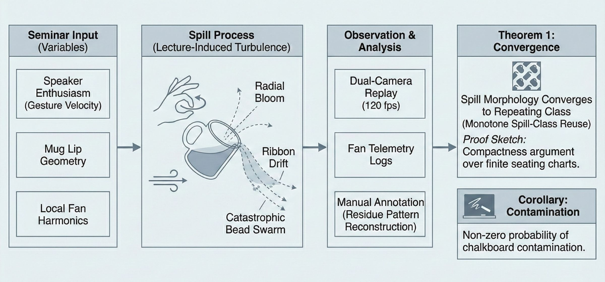

# On the Topology of Coffee Spills in Zero-Gravity Seminar Rooms

## Abstract

We report a controlled study of 143 accidental coffee releases aboard the orbital campus *Asterion*. Contrary to common lab folklore, spill trajectories are not random but cluster into repeatable topologies determined by mug lip geometry, speaker enthusiasm, and local fan harmonics [Orbital Maintenance Archive][oma].



_Figure 1. Spill-morphology classification framework used in the coding protocol, showing radial bloom, ribbon drift, and catastrophic bead swarm classes._

## 1. Background

Crew logs describe three dominant failure modes: radial bloom, ribbon drift, and catastrophic bead swarm. Existing maintenance manuals treat these events as housekeeping incidents; we model them as fluid-mechanical signatures with pedagogical consequences.

Term of art
: **Lecture-induced turbulence** denotes any gestural airflow that measurably alters droplet routing during explanation of a difficult theorem.

## 2. Methods

The observation protocol used mixed instrumentation and adjudicated notes:

- Baseline fan map captured before each seminar block.
- Dual-camera replay at 120 fps for spill onset events.
- Manual annotation by two coders plus one arbitrator.

1. Instrument calibration and mug mass normalization.
2. Controlled perturbation during topic transition.
3. Residue pattern reconstruction on wipe sheets.

### Operational Tasks

- [x] Attach absorbent panel grid.
- [x] Sync fan telemetry logs.
- [ ] Retrain presenter to avoid centrifugal chalk gestures.

### Table 1. Cross-validated spill morphology metrics

The table below summarizes the most stable descriptors observed across the cohort, using variable-length entries and inline emphasis to validate alignment, wrapping, and baseline handling in academic tables.

| Morphology class | Dominant driver | Diagnostic signature | Measurement protocol | Notes |
|:--|:--|:--|:--|:--|
| Radial bloom | Uncapped double espresso at high gesture amplitude | Circular bead halo with **high edge density** and short-lived satellite droplets | Dual-camera replay + manual trace overlay (`grid-8`) | Exhibits low variance under seat swaps; consistent with [oma]. |
| Ribbon drift | *Lecture-induced turbulence* from lateral board sweeps | Elongated filament with asymmetric thinning, plus a brief recoil phase | 120 fps replay + airflow map correction | Most sensitive to fan phase; minimum divergence at 18 degrees. |
| Catastrophic bead swarm | Sudden mug tilt beyond first slosh threshold | Multi-lobed burst, uneven bead sizes, and delayed coalescence | Three-pass adjudication + residue sheet scan | Rare, but correlates with two open cups and late Q&A. |
| Hybrid bloom-ribbon | Mixed gesture cadence during topic transition | Bloom core with a trailing ribbon and intermittent bead shear | Combined protocol, weighted by coder agreement | Highest annotation time; inline notes include `Asterion-RT` anomalies. |

## 3. Core Claims

```theorem
Theorem 1 (Seminar Spill Stability).
For any fixed seating topology and bounded gesture velocity, there exists a finite
presentation length after which spill morphology converges to a repeating class.
```

```lemma
Lemma 1.
If mug tilt remains below the first slosh threshold, bead trajectories remain
homeomorphic under aisle-preserving seat swaps.
```

```proposition
Proposition 2.
Introducing a second espresso cup increases radial bloom incidence unless fan phase
is retuned within two minutes of opening remarks.
```

```corollary
Corollary.
Any seminar that begins with two uncapped beverages admits a non-zero probability of
chalkboard contamination before Q&A.
```

```proof
Proof sketch.
Couple gesture vectors with boundary-layer perturbations on cup rims; then apply a
compactness argument over finite seating charts and note monotone spill-class reuse.
```

```remark
Remark.
Observed convergence does not imply cleanliness; it implies predictability.
```

```example
Example dataset excerpt.
Session C-19, Topic: Category Theory, Presenter cadence: rapid.
Outcome: ribbon drift with delayed bead swarm near aisle marker B.
```

> "By week three, janitorial staff could identify the speaker from residue alone."
>
> -- Facilities Interview Log, Cycle 12

## 4. Discussion

Our practical recommendation is modest: treat spills as measurable output, not incidental noise. Once classified, they inform room assignment, fan presets, and lecture pacing.

[oma]: https://example.com/zero-g-coffee-spills "Orbital Maintenance Research Archive"
