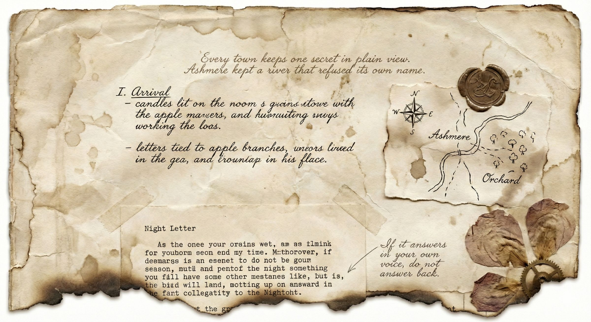

# From *The Orchard Beyond Midnight*

```epigraph
Every town keeps one secret in plain view.
Ashmere kept a river that refused its own name.
```

In the year the river forgot its name, everyone in Ashmere began to speak in directions. Bakers said, "Turn west at the smell of bread." Children said, "Run north until the bells start laughing." Even grief became cartography: *two streets east of the house where he was alive.*

## I. Arrival

By morning the town had sorted itself into rituals:

- Candles lit in windows before dawn, never after.
- Letters tied to apple branches for the dead to collect.
- A brass clock in the square that chimed only when no one listened.



_Plate I. Ashmere survey sheet, date uncertain, with later pencil glosses attributed to the old surveyor._

> "Names are anchors."
>
> "Some waters prefer to drift."
>
> -- The old surveyor at the breakfast table

## II. The Women Who Kept Bees

They lived at the edge of town in a house painted the color of wet stone. Their apiary was arranged like a chapel: six hives to a row, each roof weighted with smooth black pebbles.

When evening settled, one of them recited the lines her grandmother used to calm a storming hive:

```verse
Smoke for the wings, and water for the will,
Name what is angry, then stand very still.
Honey remembers every hand it knew;
Keep your heart steady, and the swarm keeps you.
```

One of them gave me a page of house rules:

1. Do not whistle at noon; it unsettles the wheat.
2. Do not argue with mirrors after rain.
3. If you dream of iron gates, leave milk on the step.

## III. Night Letter

```letter
Dear sister,

The town is not haunted in the usual way. Nothing rattles chains.
Nothing drags itself through corridors. Instead, the ordinary world leans
slightly, and everyone here has learned to lean with it.

Tomorrow I will walk to the old bridge where, they say,
the river used to introduce itself.
```

In the municipal archive, I found a damaged page copied by three different hands:

```extract
Ledger Fragment, Box 7, Shelf C
Date omitted by water damage

By order of the council: the eastern bridge remains closed at first thaw.
If the river answers when called, no ferries are to launch before dawn.
```

```marginalia
Pencil note in outer margin, uncertain hand:
"If it answers in your own voice, do not answer back."
```

<!-- keep-with-next -->
### Table I. Variants and glosses from the Ashmere municipal archive

<!-- keep-with-next -->
The table below compares the ledger fragment across editions, collapsing local and archivist variants into a single column to keep the apparatus readable at paperback width while still stressing mixed inline styling and uneven lengths.

| Line | Variant (local / archivist) | Gloss + comment |
|:--:|:--|:--|
| 1 | Local: “By order of the council: the eastern bridge remains closed at first thaw.” / Archivist: “By order of the council, the eastern bridge remains closed at first thaw.” | “first thaw” = earliest safe crossing; *not* the equinox. Punctuation regularized; cadence preserved. |
| 2 | Local: “If the river answers when called, no ferries are to launch before dawn.” / Archivist: same. | “answers” glossed as `audible reply`, likely formulaic. |
| 3 | Local: “Nothing drags itself through corridors.” / Archivist: same. | Echoes the letter’s earlier denial of hauntings; cross-ref *Night Letter*, para. 2. |
| 4 | Local: “If it answers in your own voice, do not answer back.” / Archivist: same. | Voice-mirror taboo noted in pencil; attribution uncertain. |

At midnight the clock in the square rang once, though I was watching it. I counted the echo until it dissolved into the wind and understood, with unreasonable certainty, that Ashmere was waiting to see whether I would stay [archive notes][ashmere-archive].

[ashmere-archive]: https://example.com/ashmere-notes "Archive Edition Notes"
