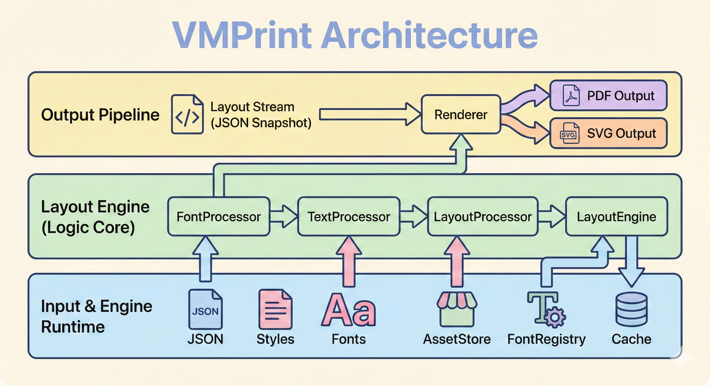

# VMPrint Deployment Handbook

This default markdown flavor targets a modern technical manual: comfortable on screen, crisp in print, and visually structured for fast scanning during implementation work [manual].

[manual]: https://example.com/vmprint/handbook "VMPrint Deployment Handbook"

## 1. Design Intent

The baseline should preserve typographic discipline while still feeling contemporary. Paragraphs remain calm and readable, headings carry color hierarchy, and code examples are framed for quick reference without overwhelming the page.

## 2. Readiness Checklist

### Diagram Preview



_Figure 1. VMPrint architecture overview. The diagram should scale naturally in flow and preserve stable spacing around surrounding blocks._

- [x] Confirm parser and semantic normalization are deterministic.
- [x] Confirm citation + references flow for print-safe links.
- [ ] Validate final output against release checklist in staging.

1. Build with explicit flavor selection.
2. Validate list and continuation spacing.
3. Review final PDF at 100% and 150% zoom.
   1. Check heading rhythm and visual hierarchy.
   2. Check code and quote panel contrast.

   This continuation paragraph intentionally stays under the same list item so continuation indentation is easy to verify.

### Release Gate Summary

The table below summarizes the deployment gates used by the VMPrint release team. It should read like a polished operations handbook while keeping spacing tight and columns aligned.

| Gate | Primary artifacts | Owner | Exit criteria | Status |
|:--|:--|:--|:--|:--:|
| Build integrity | Versioned build + dependency lock (pinned via `pnpm-lock.yaml`) | Build engineering | Clean build logs, reproducible output, and `--strict` compile passes | **Ready** |
| Render QA | Fixture suite + delta report (PDF diff + screenshot grid) | Publishing QA (nightly) | Pagination signatures stable across two runs; *no overflow warnings* | In review |
| Accessibility | Tagged PDF + contrast sweep + link map | Documentation | Captions present; references resolve; alt text sanity-checked | **Ready** |
| Packaging | Release notes + checksum + provenance (`sha256`) | Release manager | Signed artifacts posted to registry; `draft2final` CLI smoke test passes | Pending |
| Rollout | Change record + support brief + [launch playbook](https://example.com/vmprint/playbook) | Program lead | Stakeholders notified, monitoring enabled, and rollback rehearsal complete | Scheduled |

## 3. Authoring Guidance

Compositor lockup
: A recurring line-break pattern that should remain stable across repeated builds.

Release hygiene
: The practice of preserving structural consistency while updating only content.

> Treat formatting as product behavior, not decoration.
>
> Every style decision should improve comprehension time.
>
> -- Internal Publishing Standards

---

### 4. Command Snippets

```bash
npm run build
npm run dev -- build src/formats/markdown/flavors/sample_default.md -o out.pdf --format markdown --flavor default
```

```ts
export function classifyParagraph(width: number, lineCount: number): string {
  if (lineCount <= 3) return 'compact';
  if (width < 360) return 'narrow-column';
  return 'body-copy';
}
```

```json
{
  "format": "markdown",
  "flavor": "default",
  "notes": "screen and print balanced"
}
```

Final note: this sample should demonstrate that the default flavor can be practical, publication-grade, and still visually modern.
